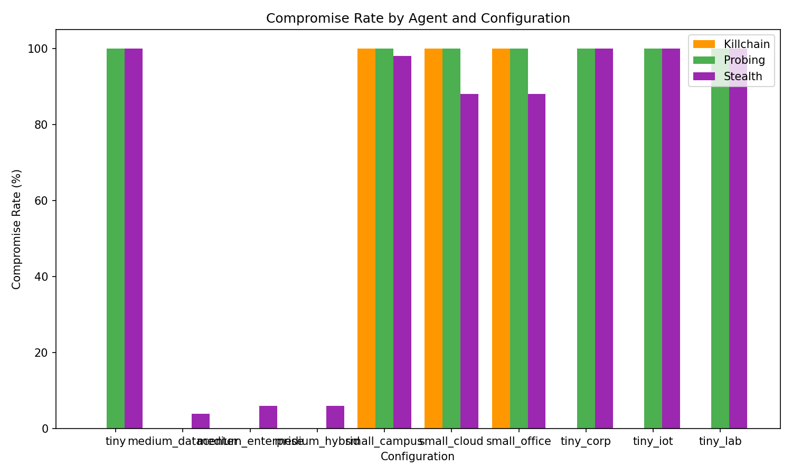
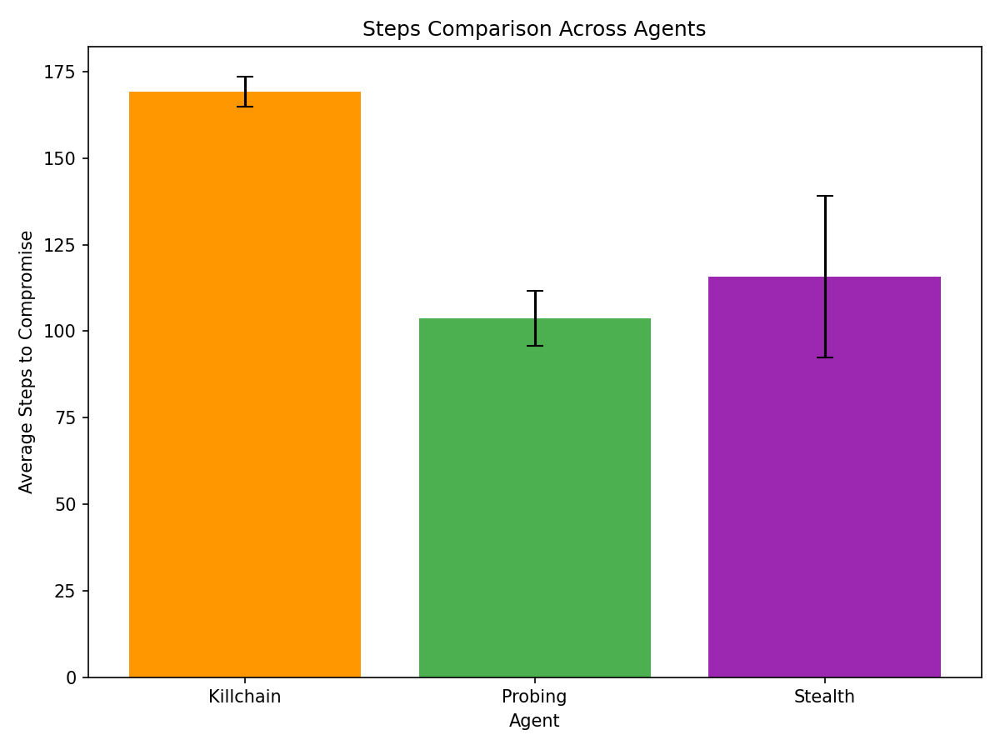
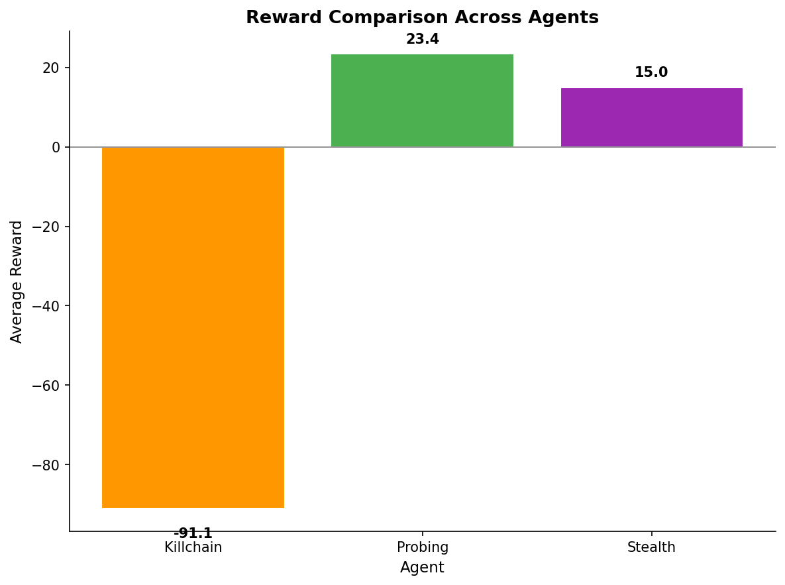
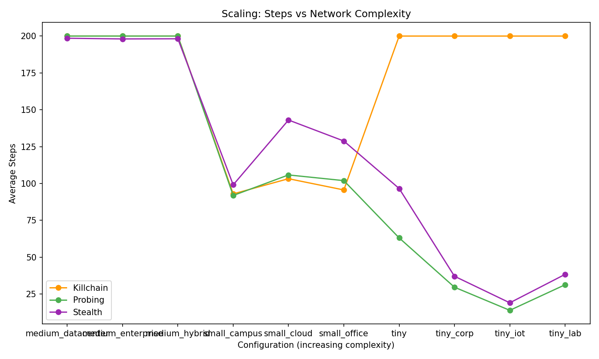
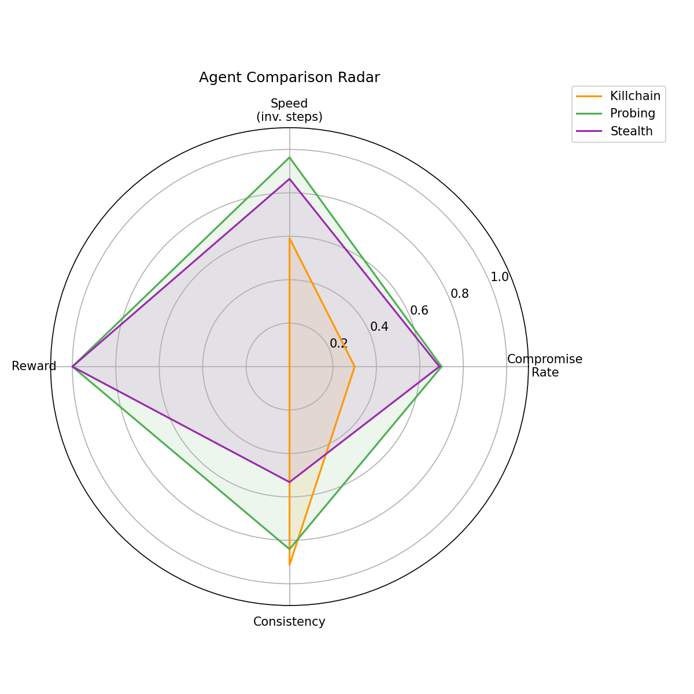
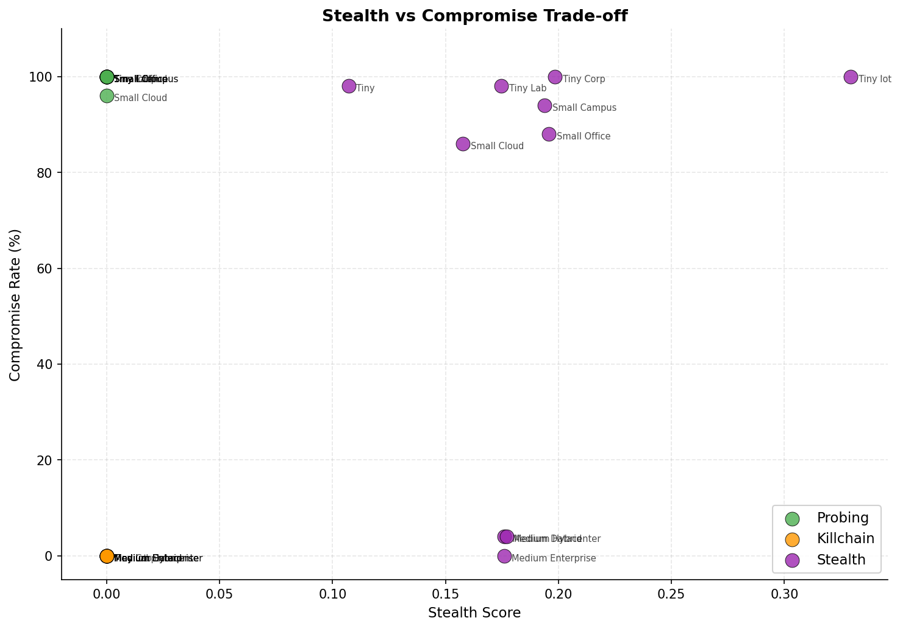

# CyberSim -- LLM-Driven Cybersecurity Simulation Framework

CyberSim is a Python framework that demonstrates how Large Language Models can
generate realistic cybersecurity environments -- expressed as YAML network
configurations -- suitable for training and evaluating reinforcement-learning
agents.  Built on top of NASim, the framework pairs nine LLM-generated network
topologies with four purpose-built attack agents and an automated benchmarking
pipeline, providing end-to-end evidence that LLM-authored configs produce
training dynamics comparable to hand-crafted baselines.

## Key Features

- **Abstract simulator interface** -- swap NASim for any future simulator without changing agent code.
- **4 attack agents** -- PPO (RL baseline), Probing, Kill Chain, and Stealth, each modelling a distinct adversarial strategy.
- **Topology validation** -- automated checks that every LLM-generated YAML satisfies NASim structural constraints.
- **Automated benchmarking** -- single-command evaluation across all configs and agents, producing 6 publication-ready chart types.
- **9 LLM-generated configs** -- three size tiers (tiny / small / medium) covering office, campus, cloud, IoT, enterprise, datacenter, and hybrid topologies.

## Architecture

```
SimulatorInterface (ABC)
  └── NaSimAdapter

AttackAgent (ABC)
  ├── PPOAgent          (RL -- Stable-Baselines3)
  ├── ProbingAgent      (breadth-first scan + exploit)
  ├── KillChainAgent    (5-phase attack lifecycle)
  └── StealthAgent      (minimal footprint + priv-esc)

BenchmarkRunner ──► metrics.py  ──► plots.py
                                      ├── compromise_rates.png
                                      ├── steps_comparison.png
                                      ├── time_comparison.png
                                      ├── scaling.png
                                      ├── agent_radar.png
                                      └── stealth_tradeoff.png

TopologyValidator ──► validates every YAML before simulation
```

## Quick Start

```bash
pip install -e ".[dev]"
python -m cybersim.benchmarks.runner --output assets/ --episodes 100
```

## Benchmark Results








## Agents

| Agent | Strategy | Key Metric | Paper Section |
|-------|----------|------------|---------------|
| PPO | RL baseline, Stable-Baselines3 PPO | Reward convergence | Section 3.6 |
| Probing | Breadth-first scan + exploit | Speed | Section 3.4.1 |
| Kill Chain | Multi-stage attack (5 phases) | Realism | Section 3.4.2 |
| Stealth | Minimal footprint + privilege escalation | Stealth Score | Section 3.4.3 |

## Project Structure

```
cybersim/
├── __init__.py
├── agents/
│   ├── __init__.py
│   ├── base.py               # AttackAgent ABC
│   ├── ppo_agent.py          # PPOAgent
│   ├── probing_agent.py      # ProbingAgent
│   ├── killchain_agent.py    # KillChainAgent
│   └── stealth_agent.py      # StealthAgent
├── benchmarks/
│   ├── __init__.py
│   ├── metrics.py            # Metric calculations
│   ├── plots.py              # 6 chart generators
│   └── runner.py             # CLI benchmark runner
├── configs/
│   ├── baselines/
│   │   └── tiny.yaml
│   └── generated/
│       ├── tiny_corp.yaml
│       ├── tiny_iot.yaml
│       ├── tiny_lab.yaml
│       ├── small_campus.yaml
│       ├── small_cloud.yaml
│       ├── small_office.yaml
│       ├── medium_datacenter.yaml
│       ├── medium_enterprise.yaml
│       └── medium_hybrid.yaml
├── simulators/
│   ├── __init__.py
│   ├── base.py               # SimulatorInterface ABC
│   └── nasim_adapter.py      # NaSimAdapter
├── utils/
│   ├── __init__.py
│   ├── helpers.py
│   └── logger.py
└── validation/
    ├── __init__.py
    └── topology.py           # TopologyValidator
```

## Citation

```bibtex
@article{kampakis2025cybersim,
  title={Proving the Utility of Large Language Models in Cybersecurity Simulations: A Comprehensive Examination},
  author={Kampakis, Stylianos and Rovai, Fabio and Charalambides, Marcos and Mourouzis, Theodosis},
  year={2025}
}
```

## License

MIT
